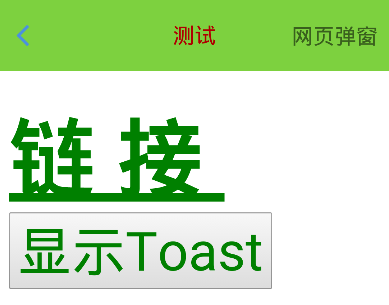

Title: Android WebView实现原生与JavaScript的交互
Date: 2016-11-21
Modified: 2016-11-21
Tags: Android,WebView
Slug: android_webview_native_javascript_interaction
Authors: Cokernut
Summary: Android WebView实现原生与JavaScript的交互

在现在的Android开发中，为了追求开发的效率以及移植的便利性，越来越多的开发者会在App中使用WebView
作为部分业务内容展示与交互的主要载体。那么在这种Hybrid App中，难免就会遇到网页与Java
原生的交互问题，比如说调用Java方法去做那部分网页不能完成的功能或者是通过Java原生代码
来调用网页当中实现的一些功能，其中一种解决方案就是利用Java与网页中的JavaScript进行交互。 

实现思路是:  

+ 通过WebView注入带有Java方法的JavaScript对象，然后网页当中利用JavaScript对注入的方法进行调用这样就实现了网页调用原生功能
+ 通过WebView注入JavaScript的方式来实现原生调用网页中的功能

## 实现步骤：  
1、 自定义WebView
```java
public class MyWebView extends WebView {

    private WebViewInterface mWebViewInterface;

    public MyWebView(Context context) {
        super(context);
        init();
    }

    public void setWebViewInterface(WebViewInterface baseWebViewInterface) {
        mWebViewInterface = baseWebViewInterface;
    }

    //回调方法接口
    public interface WebViewInterface {
        void showToast(String msg);

        void getTitle(String title);
    }

    public void init() {
        WebSettings ws = getSettings();
        setLayoutParams(new ViewGroup.LayoutParams(ViewGroup.LayoutParams.MATCH_PARENT, ViewGroup.LayoutParams.MATCH_PARENT));
        setHorizontalScrollBarEnabled(false);
        setVerticalScrollBarEnabled(false);
        ws.setJavaScriptEnabled(true);
        ws.setDomStorageEnabled(true);
        ws.setSupportZoom(true);
        ws.setBuiltInZoomControls(true);
        ws.setBuiltInZoomControls(false);
        ws.setJavaScriptCanOpenWindowsAutomatically(true);
        //注入带有Java方法的JS对象，名字可以自定义（js_obj）
        addJavascriptInterface(new InJavaScriptObj(), "js_obj");
        setWebViewClient(new MyWebViewClient());
        setWebChromeClient(new MyWebChromeClient());
    }

    final class InJavaScriptObj {
        //android 4.2 之后版本提供给js调用的函数必须带有注释语句@JavascriptInterface
        @JavascriptInterface
        public void showToast(String msg) {
            mWebViewInterface.showToast(msg);
        }
    }

    private class MyWebViewClient extends WebViewClient {
        @Override
        public boolean shouldOverrideUrlLoading(WebView view, String url) {
            //加载网页url，此处可以根据url进行相应的处理
            return super.shouldOverrideUrlLoading(view, url);
        }

        @Override
        public void onPageFinished(WebView view, String url) {
            //实现自己的逻辑
            super.onPageFinished(view, url);
        }

        @Override
        public void onPageStarted(WebView view, String url, Bitmap favicon) {
            super.onPageStarted(view, url, favicon);
            //实现自己的逻辑
        }

        @Override
        public void onReceivedError(WebView view, WebResourceRequest request, WebResourceError error) {
            //错误处理
            super.onReceivedError(view, request, error);
        }

        @Override
        public void onReceivedHttpError(WebView view, WebResourceRequest request, WebResourceResponse errorResponse) {
            //http错误处理
            super.onReceivedHttpError(view, request, errorResponse);
        }
    }

    private class MyWebChromeClient extends WebChromeClient {

        @Override
        public void onReceivedTitle(WebView view, String title) {
            super.onReceivedTitle(view, title);
            //这个方法是收到网页的title的时候会调用的，这里我们可以拿到网页的title显示处理
            mWebViewInterface.getTitle(title);
        }

        @Override
        public boolean onJsAlert(WebView view, String url, String message, final JsResult result) {
            // 在这里你可以拦截网页的Alert来实现自己的逻辑，return true停止事件的继续传播，也可以使用默认实现
            return super.onJsAlert(view, url, message, result);
        }

        @Override
        public boolean onJsConfirm(WebView view, String url, String message, JsResult result) {
            // 在这里你可以实现拦截网页的Confirm来实现自己的逻辑，return true停止事件的继续传播，也可以使用默认实现
            return super.onJsConfirm(view, url, message, result);
        }

        @Override
        public void onProgressChanged(WebView view, int newProgress) {
            super.onProgressChanged(view, newProgress);
            //在这里你可以进度的变化实现自己的逻辑
        }

        @Override
        public boolean onJsPrompt(WebView view, String url, String message, String defaultValue, JsPromptResult result) {
            return super.onJsPrompt(view, url, message, defaultValue, result);
        }
    }
}
```
2、使用自定义WebView来实现功能
> 布局文件：
```xml
<?xml version="1.0" encoding="utf-8"?>  
<RelativeLayout xmlns:android="http://schemas.android.com/apk/res/android"  
    android:layout_width="match_parent"  
    android:layout_height="match_parent"  
    android:orientation="vertical">  
  
    <RelativeLayout  
        android:id="@+id/rl_top"  
        android:layout_width="match_parent"  
        android:layout_height="wrap_content"  
        android:padding="10dp"  
        android:background="#7DD13F"  
        android:minHeight="?attr/actionBarSize">  
  
        <ImageView  
            android:id="@+id/iv_back"  
            android:layout_width="wrap_content"  
            android:layout_height="wrap_content"  
            android:layout_centerVertical="true"  
            android:gravity="center"  
            android:paddingBottom="12dp"  
            android:paddingRight="12dp"  
            android:paddingTop="12dp"  
            android:src="@mipmap/icon_back" />  
  
        <TextView  
            android:id="@+id/tv_title"  
            android:layout_width="wrap_content"  
            android:layout_height="wrap_content"  
            android:layout_centerInParent="true"  
            android:ellipsize="end"  
            android:gravity="center"  
            android:maxEms="8"  
            android:textColor="#AF0000"  
            android:singleLine="true"  
            android:textSize="20sp" />  
  
        <TextView  
            android:id="@+id/tv_menu"  
            android:layout_width="wrap_content"  
            android:layout_height="wrap_content"  
            android:layout_alignParentRight="true"  
            android:layout_centerVertical="true"  
            android:gravity="center_vertical|right"  
            android:text="网页弹窗"  
            android:textSize="20sp"/>  
    </RelativeLayout>  
  
    <LinearLayout  
        android:id="@+id/ll_webview"  
        android:layout_width="match_parent"  
        android:layout_height="match_parent"  
        android:layout_below="@+id/rl_top"  
        android:orientation="vertical">  
  
    </LinearLayout>  
  
</RelativeLayout>  
```
> WebViewActivity:
```java
public class WebViewActivity extends AppCompatActivity implements MyWebView.WebViewInterface, View.OnClickListener {

    private LinearLayout    mWebViewLl;
    private MyWebView       mWebView;
    private ImageView       mBackIv;
    private TextView        mTitleTv;
    private TextView        mMenuTv;

    private String          url;

    private static final int SET_TITLE = 0x101;

    private Handler mHandler = new Handler() {
        @Override
        public void handleMessage(Message msg) {
            if (msg.what == SET_TITLE) {
                setMyTitle((String) msg.obj);
            }
        }
    };

    @Override
    protected void onCreate(Bundle savedInstanceState) {
        super.onCreate(savedInstanceState);
        setContentView(R.layout.activity_webview);
        initView();
    }

    private void initView() {
        url = getIntent().getStringExtra("url");
        mMenuTv     = (TextView) findViewById(R.id.tv_menu);
        mBackIv     = (ImageView) findViewById(R.id.iv_back);
        mWebViewLl  = (LinearLayout) findViewById(R.id.ll_webview);
        mTitleTv    = (TextView) findViewById(R.id.tv_title);
        mMenuTv.setOnClickListener(this);
        mBackIv.setOnClickListener(this);
        mWebView    = new MyWebView(this);
        mWebViewLl.addView(mWebView);
        mWebView.setWebViewInterface(this);
        mWebView.loadUrl(url);
    }


    //回调方法的实现
    @Override
    public void showToast(String msg) {
        Toast.makeText(this, msg, Toast.LENGTH_SHORT).show();
    }

    //回调方法的实现
    @Override
    public void getTitle(String title) {
        Message message = new Message();
        message.what = SET_TITLE;
        message.obj = title;
        mHandler.sendMessage(message);
    }

    private void setMyTitle(String title) {
        mTitleTv.setText(title);
    }

    @Override
    public void onBackPressed() {
        back();
    }

    private void back() {
        if (mWebView.canGoBack()) {
            mWebView.goBack();
        } else {
            this.finish();
        }
    }

    @Override
    public void onClick(View v) {
        switch (v.getId()) {
            case R.id.iv_back:
                back();
                break;
            case R.id.tv_menu:
                //注入JS代码,Java调用JS
                mWebView.loadUrl("javascript:alert('网页弹窗alert');");
                break;
        }
    }
}
```
> 网页代码：
```html
<head>
    <title>测试</title>
    <style>
        a{
            color:green;
            font-weight:900;
            font-size:80px;
            height:400;
            width:500;
        }

        button{
            color:green;
            font-size:50px;
            height:300;
            width:400;
        }
    </style>
    <script>
        //JS调用Java方法，js_obj为网页中带有Java方法的对象，可以自定义但是要和注入的名字一样
        function myFunction() {
            js_obj.showToast("显示Toast");
        }
    </script>
</head>
<br>

<a href="file:///android_asset/test_1.html"> 链 接 </a> </br>
<button onclick="myFunction()" >显示Toast</button>
</body>
</html>
```
效果图:  
  
<font size="5">[源代码](https://github.com/cokernut/CustomWebView)</font>